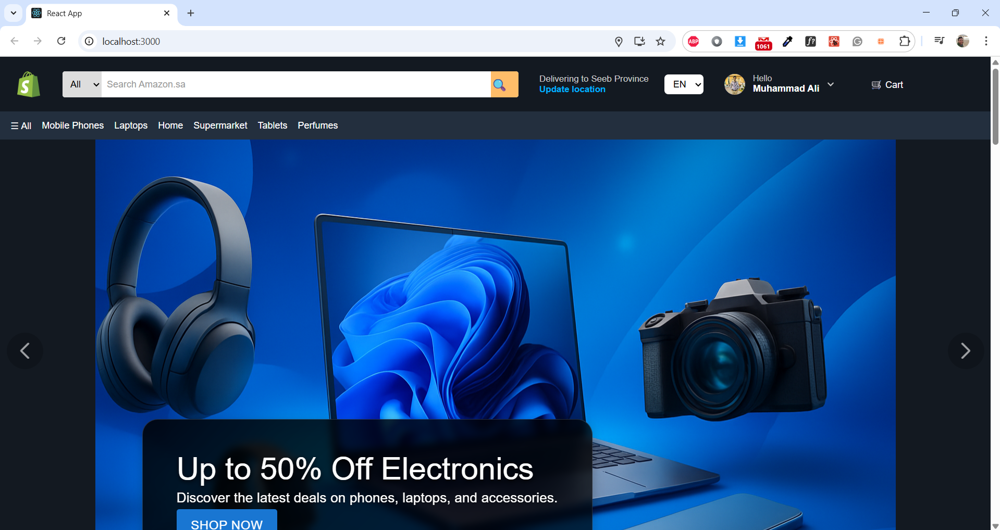
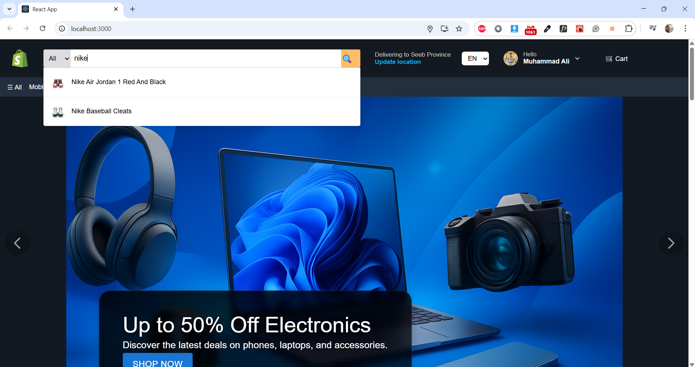
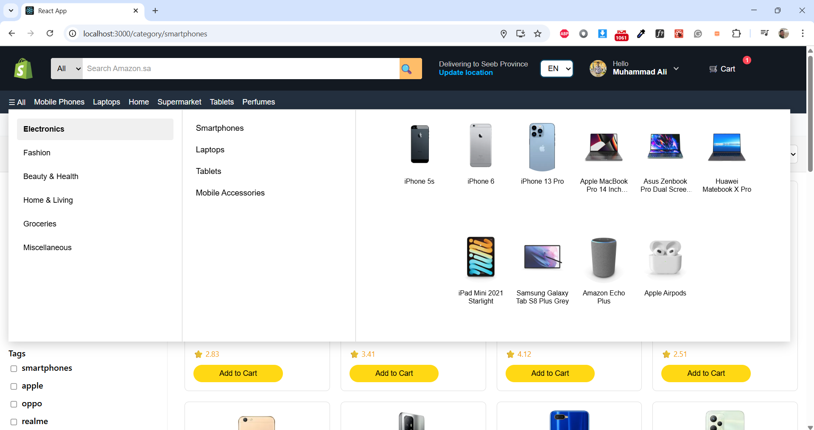
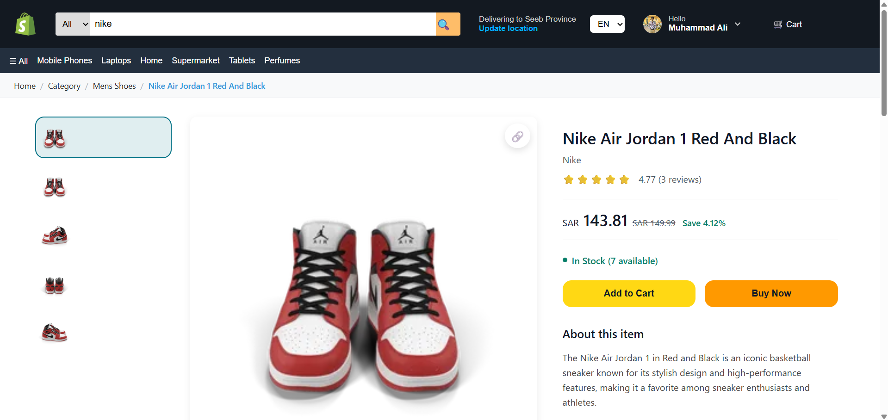
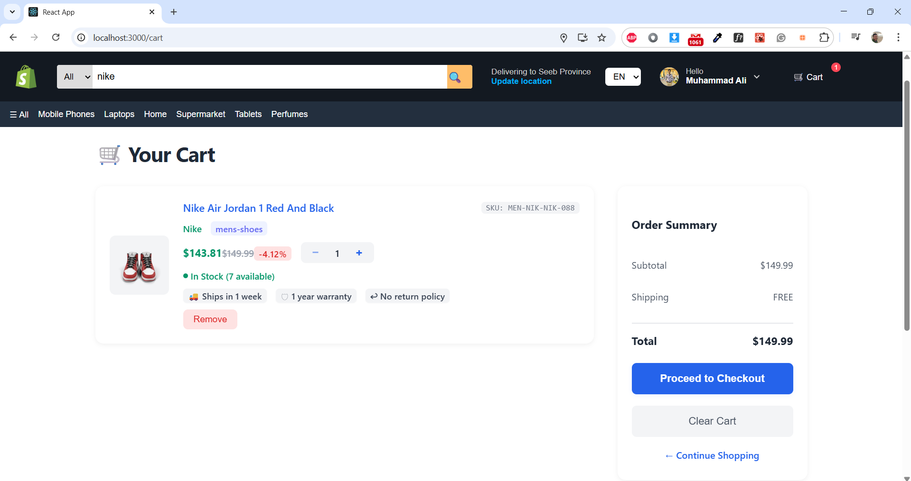
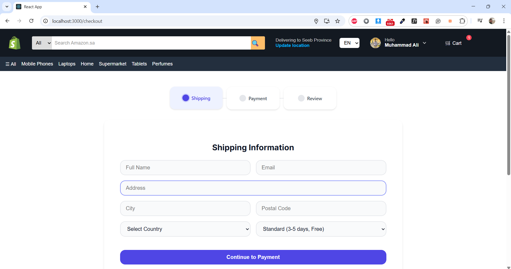
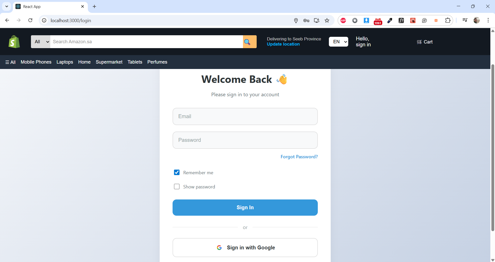
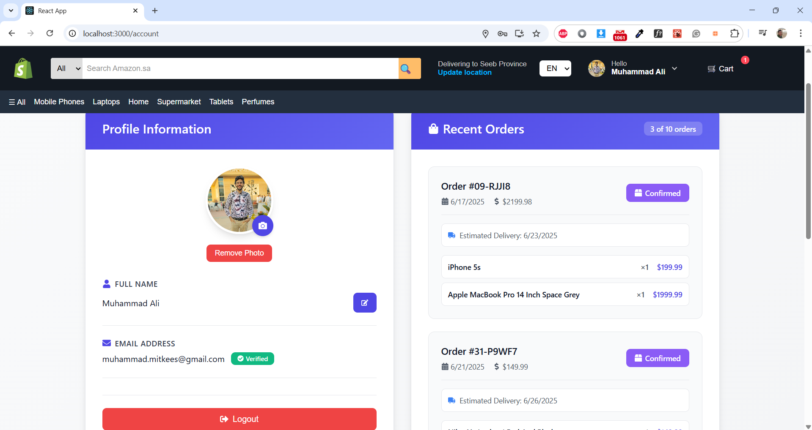
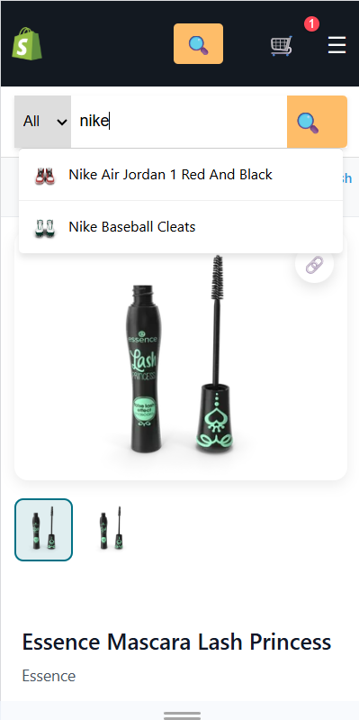
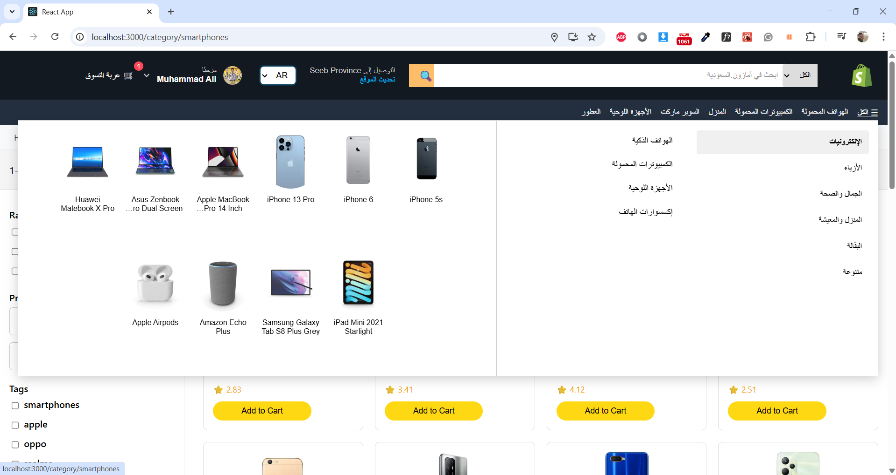

# 🛒 Modern E-Commerce Platform

[](https://reactjs.org/)
[](https://redux-toolkit.js.org/)
[](https://firebase.google.com/)
[](https://stripe.com/)
[](https://react.i18next.com/)

A comprehensive, modern e-commerce platform built with React, featuring advanced shopping capabilities, secure authentication, multilingual support, and responsive design. This project showcases expertise in modern frontend development, state management, UI/UX design, and integration with third-party services.

## 🌟 Key Features

### 🔐 Authentication & User Management

- **Multi-platform Authentication**: Email/password and Google OAuth integration
- **User Account Management**: Profile management, order history, and personalized dashboard
- **Auto-login**: Encrypted credential storage with secure auto-authentication
- **Email Verification**: Firebase-powered email verification system

### 🛍️ Shopping Experience

- **Advanced Product Catalog**: Dynamic product listings with detailed views
- **Smart Search & Filtering**: Real-time search with autocomplete suggestions
- **Mega Menu Navigation**: Hoverable mega menu with categories, subcategories, and product previews
- **Category Navigation**: Hierarchical category system with visual navigation
- **Shopping Cart**: Persistent cart with real-time updates and quantity management
- **Product Recommendations**: AI-powered related products suggestions

### 💳 Checkout & Payments

- **Multi-step Checkout Process**: Streamlined 3-step checkout flow
- **Stripe Integration**: Secure credit card payment processing
- **Cash on Delivery**: Alternative payment option
- **Order Management**: Complete order tracking and history
- **Shipping Options**: Multiple delivery methods with cost calculation

### 🌍 Internationalization

- **Multilingual Support**: English and Arabic language support
- **RTL/LTR Layout**: Automatic layout direction switching
- **Localized Content**: Translated UI elements and content
- **Regional Currency**: USD to OMR currency conversion

### 🎨 UI/UX & Design

- **Responsive Design**: Mobile-first approach with breakpoint optimization
- **Modern CSS Architecture**: CSS Modules with custom properties
- **Interactive Mega Menu**: Hover-activated navigation with smooth transitions
- **Animation & Interactions**: Framer Motion animations and micro-interactions
- **Component Library**: Reusable UI components with consistent design system
- **Dark/Light Theme**: Theme switching capability
- **Accessibility**: ARIA labels and keyboard navigation support

### 📱 Progressive Features

- **Mobile Optimization**: Touch-friendly interface with swipe gestures
- **Loading States**: Skeleton loading and spinner animations
- **Error Handling**: Comprehensive error boundaries and user feedback
- **Toast Notifications**: Real-time user notifications
- **Image Optimization**: Lazy loading and responsive image handling

## 🚀 Tech Stack

### Frontend Framework

- **React 18.3.1** - Modern React with hooks and concurrent features
- **React Router 6.30.0** - Client-side routing with nested layouts
- **Redux Toolkit** - State management with RTK Query
- **React Redux** - React bindings for Redux

### Styling & UI

- **CSS Modules** - Scoped CSS with component-level styling
- **CSS Custom Properties** - Design system with CSS variables
- **Responsive Design** - Mobile-first approach with flexbox/grid
- **Framer Motion** - Advanced animations and transitions
- **React Icons** - Comprehensive icon library
- **Swiper.js** - Touch slider components

### Authentication & Database

- **Firebase Auth** - Authentication service with multiple providers
- **Firestore** - NoSQL database for user data and orders
- **Google OAuth** - Social login integration
- **CryptoJS** - Client-side encryption for sensitive data

### Payment Processing

- **Stripe** - Secure payment processing
- **Stripe React Elements** - Pre-built payment UI components

### Internationalization

- **react-i18next** - Internationalization framework
- **i18next-browser-languagedetector** - Automatic language detection

### Development Tools

- **Create React App** - Development environment and build tools
- **ESLint** - Code linting and formatting
- **React Testing Library** - Component testing utilities

### APIs & Data

- **DummyJSON API** - Product data source
- **Axios** - HTTP client for API requests
- **Custom API Layer** - Abstracted data fetching logic

## 📁 Project Structure

```
src/
├── Components/           # Reusable UI components
│   ├── Navbar/          # Navigation with search, mega menu, and user menu
│   │   ├── AllCategoriesMenu/  # Hoverable mega menu component
│   │   ├── SearchBar/   # Smart search with autocomplete
│   │   └── MobileMenu/  # Mobile-responsive navigation
│   ├── Footer/          # Site footer with links
│   ├── ProductPageComponents/  # Product-specific components
│   ├── HomePageComp/    # Homepage sections and layouts
│   ├── CategoriesComp/  # Category navigation and filtering
│   ├── AuthLoader/      # Authentication loading states
│   ├── Breadcrumbs/     # Navigation breadcrumbs
│   └── DiscountPopup/   # Promotional popup component
├── Pages/               # Route-level page components
│   ├── HomePage/        # Landing page with product sections
│   ├── Product/         # Individual product pages
│   ├── Cart/           # Shopping cart management
│   ├── Checkout/       # Multi-step checkout process
│   ├── Login/          # Authentication pages
│   ├── Register/       # User registration
│   ├── AccountPage/    # User dashboard and profile
│   ├── SearchPage/     # Search results and filtering
│   ├── CategoryPage/   # Category-specific product listings
│   ├── About/          # Company information pages
│   ├── Blog/           # Content management and blog
│   ├── Orders/         # Order history and tracking
│   └── NotFound/       # 404 error page with animations
├── redux/              # State management
│   ├── store.js        # Redux store configuration
│   └── slices/         # Feature-specific state slices
├── layouts/            # Page layout components
│   ├── PublicLayout.jsx    # Public pages layout
│   ├── ProtectedLayout.jsx # Authenticated user layout
├── api/                # API integration layer
├── utils/              # Utility functions and helpers
├── assets/             # Images, icons, and static files
└── firebase.js         # Firebase configuration
```

## 🎯 Feature Demonstrations

### 🔍 Advanced Search & Filtering

- **Smart Autocomplete**: Real-time search suggestions with product thumbnails
- **Mega Menu Navigation**: Interactive hoverable mega menu with 3-column layout
  - Categories column with hover activation
  - Dynamic subcategories based on selected category
  - Live product previews with thumbnails and titles
  - Skeleton loading states for smooth UX
- **Category Filtering**: Multi-level category navigation
- **Price Range Filtering**: Dynamic price sliders and range selection
- **Brand & Rating Filters**: Multiple filter combinations
- **Search Results Page**: Comprehensive results with sorting options

### 🛒 Shopping Cart & Checkout

- **Persistent Cart**: Cart state maintained across sessions
- **Quantity Management**: Real-time quantity updates with validation
- **Cart Calculations**: Dynamic pricing with discounts and shipping
- **Multi-step Checkout**: Shipping → Payment → Review workflow
- **Payment Integration**: Secure Stripe payment processing

### 👤 User Authentication

- **Social Login**: One-click Google authentication
- **Email Verification**: Secure email verification flow
- **Password Recovery**: Forgot password functionality
- **Auto-login**: Secure credential persistence
- **Profile Management**: User dashboard with order history

### 🌐 Internationalization

- **Language Switching**: Seamless English/Arabic switching
- **RTL Support**: Automatic layout mirroring for Arabic
- **Localized Content**: Translated interface elements
- **Currency Conversion**: Real-time USD to OMR conversion

### 📱 Responsive Design

- **Mobile-First Approach**: Optimized for mobile devices
- **Tablet Optimization**: Enhanced tablet experience
- **Desktop Enhancement**: Rich desktop interface
- **Touch Interactions**: Swipe gestures and touch-friendly controls

## 🎨 CSS & Styling Highlights

### Modern CSS Architecture

- **CSS Modules**: Component-scoped styling preventing conflicts
- **CSS Custom Properties**: Consistent design system with variables
- **Responsive Grid/Flexbox**: Advanced layout techniques
- **Clamp() Functions**: Fluid typography and spacing
- **CSS Animations**: Smooth transitions and micro-interactions

### Design System

```css
:root {
  --primary-blue: #007185;
  --primary-yellow: #ffd814;
  --primary-orange: #ff9900;
  --shadow-light: 0 4px 12px rgba(0, 0, 0, 0.08);
  --border-radius: 8px;
  --transition: all 0.3s ease;
}
```

### Responsive Breakpoints

- **Mobile**: < 768px - Touch-optimized interface
- **Tablet**: 768px - 1024px - Enhanced touch experience
- **Desktop**: > 1024px - Full-featured interface
- **Ultra-wide**: > 1400px - Optimized for large screens

## 🚀 Getting Started

### Prerequisites

- Node.js 14.0 or later
- npm or yarn package manager
- Firebase account for authentication
- Stripe account for payments

### Installation

1. **Clone the repository**

   ```bash
   git clone https://github.com/MuhammadMitkees/ECommerceDemo
   ```

2. **Install dependencies**

   ```bash
   npm install
   ```

3. **Environment Configuration**
   Create a `.env` file in the root directory:

   ```env
   REACT_APP_FIREBASE_API_KEY=your_firebase_api_key
   REACT_APP_FIREBASE_AUTH_DOMAIN=your_project.firebaseapp.com
   REACT_APP_FIREBASE_PROJECT_ID=your_project_id
   REACT_APP_STRIPE_PUBLIC_KEY=your_stripe_public_key
   ```

4. **Start the development server**

   ```bash
   npm start
   ```

5. **Open your browser**
   Navigate to [http://localhost:3000](http://localhost:3000)

### Building for Production

```bash
npm run build
```

This creates optimized production files in the `build/` directory.

## 📸 Screenshots & Demo

### Homepage Features


_Modern homepage with hero section, featured products, promotional banners, and testimonials_

### Product Catalog & Search


_Advanced search with real-time suggestions, category filtering, and responsive product grid_

### Mega Menu Navigation


_Interactive hoverable mega menu with categories, subcategories, and live product previews_

### Product Details Page


_Comprehensive product page with image gallery, specifications, reviews, and related products_

### Shopping Cart & Checkout


_Interactive cart with quantity management, pricing calculations, and smooth checkout flow_


_Multi-step checkout with shipping options, payment methods, and order review_

### User Authentication


_Clean authentication interface with social login and responsive design_

### User Dashboard


_Personal dashboard with order history, profile management, and account settings_

### Mobile Experience


_Fully responsive mobile interface with touch-optimized interactions_

### Internationalization



_Arabic language support with RTL layout and localized content_

## 🧪 Testing & Quality

### Code Quality

- **ESLint**: Code linting and formatting standards
- **CSS Validation**: Consistent styling and responsive design checks
- **Security**: Firebase security rules and data validation
- **Performance**: Bundle analysis and optimization recommendations

## 🌟 Advanced Features

### Performance Optimizations

- **Code Splitting**: Route-based lazy loading for faster initial load
- **Image Optimization**: WebP format and responsive image delivery
- **Caching Strategy**: Service worker implementation for offline support
- **Bundle Analysis**: Webpack optimization and tree shaking

### Animation & Interactions

- **Page Transitions**: Smooth route transitions with Framer Motion
- **Micro-interactions**: Button hover effects and loading animations
- **Gesture Support**: Swipe navigation and touch interactions
- **Progress Indicators**: Visual feedback for multi-step processes

## 🔧 Development & Skills Showcase

This project demonstrates proficiency in:

### Frontend Development

- **Modern React**: Hooks, Context API, Performance optimization
- **State Management**: Redux Toolkit with complex state logic
- **Component Architecture**: Reusable, maintainable component design
- **API Integration**: RESTful API consumption and error handling

### CSS & Styling

- **Responsive Design**: Mobile-first, cross-device compatibility
- **CSS Modules**: Scoped styling and maintainable CSS architecture
- **Animation**: Smooth transitions and engaging micro-interactions
- **Design Systems**: Consistent theming and component libraries

### User Experience

- **Internationalization**: Multi-language and cultural adaptation
- **Performance**: Optimized loading and smooth interactions
- **Error Handling**: Graceful error states and user feedback

### Third-party Integration

- **Authentication**: Firebase Auth with multiple providers
- **Payments**: Stripe integration with secure processing

## 🤝 Contributing

1. Fork the repository
2. Create a feature branch (`git checkout -b feature/AmazingFeature`)
3. Commit your changes (`git commit -m 'Add some AmazingFeature'`)
4. Push to the branch (`git push origin feature/AmazingFeature`)
5. Open a Pull Request

## 👨‍💻 Contact & Links

- **LinkedIn**: [https://www.linkedin.com/in/muhammadmitkees/](https://www.linkedin.com/in/muhammadmitkees/)
- **Email**: [muhammad.mitkees@gmail.com](mailto:muhammad.mitkees@gmail.com)
- **Live Demo**: [https://your-demo-url.com](https://your-demo-url.com)

---

<div align="center">
  <p>Built with ❤️ using React and modern web technologies</p>
  <p>⭐ Star this repository if you found it helpful!</p>
  <p><strong>Showcasing modern frontend development skills and best practices</strong></p>
</div>
